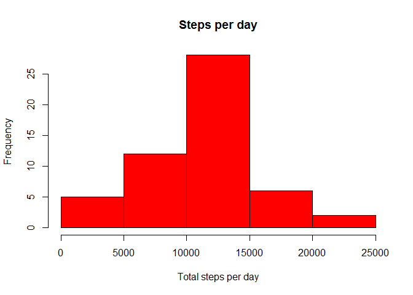
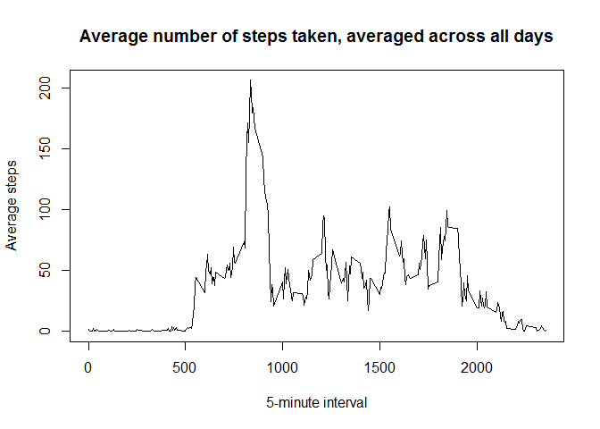
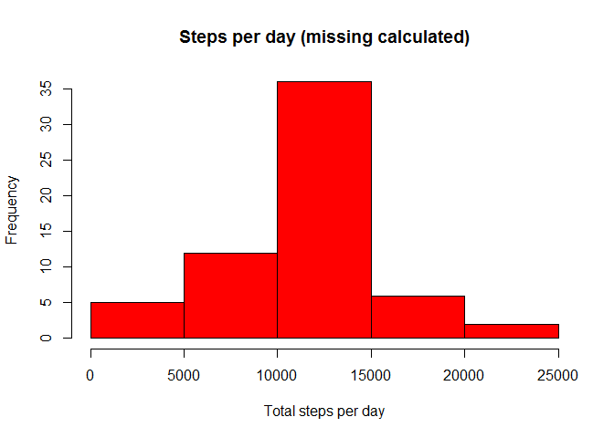
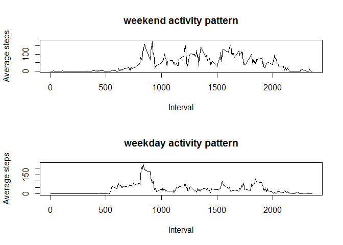

# Reproducible Research: Peer Assessment 1


## Loading and preprocessing the data

1. Unzip and load data

```r
unzip("activity.zip")
activityDs<-read.csv("activity.csv")
summary(activityDs)
```

```
##      steps                date          interval     
##  Min.   :  0.00   2012-10-01:  288   Min.   :   0.0  
##  1st Qu.:  0.00   2012-10-02:  288   1st Qu.: 588.8  
##  Median :  0.00   2012-10-03:  288   Median :1177.5  
##  Mean   : 37.38   2012-10-04:  288   Mean   :1177.5  
##  3rd Qu.: 12.00   2012-10-05:  288   3rd Qu.:1766.2  
##  Max.   :806.00   2012-10-06:  288   Max.   :2355.0  
##  NA's   :2304     (Other)   :15840
```

Explore for NA values and remove them

```r
tds<-na.omit(activityDs)
```

## What is mean total number of steps taken per day?


Summarizing total number of steps per day and make histogram


```r
library(sqldf)
sumSteps<-sqldf("select sum(steps) as step_sum, date from tds group by date")
hist(sumSteps$step_sum, col = "red", xlab = "Total steps per day", main = "Steps per day")
```

 


The mean value is 1.0766189\times 10^{4} and median is 10765

## What is the average daily activity pattern?

Average daily activity are on the next plot


```r
avgSteps<-sqldf("select avg(steps) as step_avg, interval from tds group by interval")
mint<-avgSteps[avgSteps$step_avg == max(avgSteps$step_avg),]$interval
plot(avgSteps$interval, avgSteps$step_avg,  type = 'l', xlab = '5-minute interval', ylab = 'Average steps',
     main = 'Average number of steps taken, averaged across all days')
```

 

And the maximum average value of steps are in 835 interval

## Imputing missing values
There are some missing values in data. At first we just calculate them:

```r
colSums(is.na(activityDs))
```

```
##    steps     date interval 
##     2304        0        0
```

And second, calculate missing value. We can take rounded average value for interval to fill in missing value and create another data set equal to the original dataset but with the missing data filled in. 

```r
data<-activityDs
for(i in 1:nrow(data)){
  if (is.na(data[i,"steps"])){
    dinterval<-data[i,"interval"]
    mv<-avgSteps[avgSteps$interval==dinterval,1]
    data[i,"steps"]<-round(mv)
  }
}
```

Create summary histogram


```r
sumStepsCalc<-sqldf("select sum(steps) as step_sum, date from data group by date")
hist(sumStepsCalc$step_sum, col = "red", xlab = "Total steps per day", main = "Steps per day (missing calculated)")
```

 


The mean with calculated missing value value is 1.0765639\times 10^{4} and median is 1.0762\times 10^{4}


## Are there differences in activity patterns between weekdays and weekends?

To explore this difference we have to convert Date column from our dataset to Date format. Then we extract dayweeks from date and create weekday/weekend indicator


```r
tds$date<-as.Date(tds$date)
tds$wd<-format(tds$date,'%w')
tds$weekday <- ifelse((tds$wd  == 6 | tds$wd  == 0), 'weekend', 'weekday' )
tds$weekday <- as.factor(tds$weekday)
weekend_ds<-subset(tds, weekday == 'weekend')
weekday_ds<-subset(tds, weekday == 'weekday')
aweekend_ds<-sqldf("select avg(steps) as step_avg, interval from weekend_ds group by interval")
aweekday_ds<-sqldf("select avg(steps) as step_avg, interval from weekday_ds group by interval")
par(mfrow = c(2,1))
plot(aweekend_ds$interval, aweekend_ds$step_avg,  type = 'l',xlab = 'Interval', ylab = 'Average steps', main='weekend activity pattern')
plot(aweekday_ds$interval, aweekday_ds$step_avg,  type = 'l', xlab = 'Interval', ylab = 'Average steps', main='weekday activity pattern')
```

 
